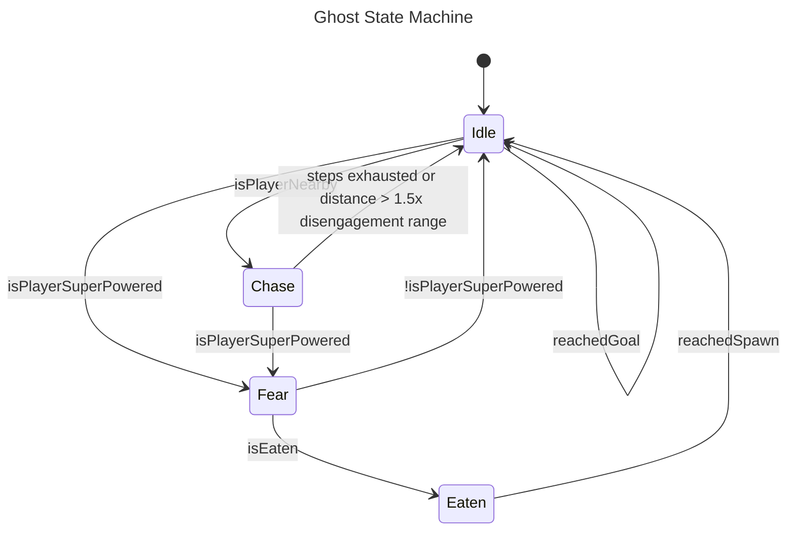

#algorithmic_thinking #java #pacman #javafx 

- ***Name:*** Zoe McFife
- ***Legal Name and Student NR:*** Bunea, S2510238021
- ***Time Spent***: 07:32:10

<hr>

# Pac Man

> “_**Pac-Man,**_ originally titled _**Puck Man**_ in Japan, is a 1980 [maze video game](https://en.wikipedia.org/wiki/Maze_video_game "Maze video game") developed and published by [Namco](https://en.wikipedia.org/wiki/Namco "Namco") for [arcades](https://en.wikipedia.org/wiki/Arcade_video_game "Arcade video game"). It was released in Japan on May 22, 1980 and by [Midway Manufacturing](https://en.wikipedia.org/wiki/Midway_Manufacturing "Midway Manufacturing") in North America in August 1980. The player controls [Pac-Man](https://en.wikipedia.org/wiki/Pac-Man_\(character\) "Pac-Man (character)"), who must eat all the dots inside an enclosed maze while avoiding [four colored ghosts](https://en.wikipedia.org/wiki/Ghosts_\(Pac-Man\) "Ghosts (Pac-Man)"). Eating large flashing dots called "Power Pellets" causes the ghosts to temporarily turn blue and vulnerable, allowing Pac-Man to eat the ghosts for bonus points.”

I created some spaghetti code this time, don’t code while tired folks. 
# Maze

Every Pac-Man needs a maze! I decided to make the maze a 2D `Tile` array, split into multiple layers. 

![[Pasted image 20260505123940.png]]
## Maze Parser

I didn’t feel like hard-coding the maze manually, so I created a `MazeParser` class that has an text representation of the maze, that converts into a `Tile` maze.

```java
public class MazeParser  
{  
    private static final String mazeAscii =  
        "############################" +  
        "#············##············#" +  
        "#·####·#####·##·#####·####·#" +  
        "#@#  #·#   #·##·#   #·#  #@#" +  
        "#·####·#####·##·#####·####·#" +  
        "#··························#" +  
        "#·####·##·########·##·####·#" +  
        "#·####·##·########·##·####·#" +  
        "#······##····##····##······#" +  
        "######·##### ## #####·######" +  
        "######·##### ## #####·######" +  
        "######·##          ##·######" +  
        "######·## ###  ### ##·######" +  
        "######·## #      # ##·######" +  
        "      ·   #      #   ·      " +  
        "######·## #      # ##·######" +  
        "######·## ######## ##·######" +  
        "######·##          ##·######" +  
        "######·## ######## ##·######" +  
        "######·## ######## ##·######" +  
        "#············##············#" +  
        "#·####·#####·##·#####·####·#" +  
        "#·####·#####·##·#####·####·#" +  
        "#@··##·······  ·······##··@#" +  
        "###·##·##·########·##·##·###" +  
        "###·##·##·########·##·##·###" +  
        "#······##····##····##······#" +  
        "#·##########·##·##########·#" +  
        "#·##########·##·##########·#" +  
        "#··························#" +  
        "############################";  
  
    public static Tile[][] createTraversalLayer()  
    {  
        Tile[][] traversalLayer = new Tile[Maze.MAZE_ROWS][Maze.MAZE_COLUMNS];  
  
        int i = 0;  
  
        for (int r = 0; r < Maze.MAZE_ROWS; r++)  
        {  
            for (int c = 0; c < Maze.MAZE_COLUMNS; c++)  
            {  
                if (mazeAscii.charAt(i) == '#' || mazeAscii.charAt(i) == ' ')  
                {  
                    traversalLayer[r][c] = parseTileString(mazeAscii.charAt(i), new TilePosition(r, c));  
                }  
                else  
                {  
                    traversalLayer[r][c] = new Tile(TileType.EMPTY, new TilePosition(r, c));  
                }  
                i++;  
            }  
        }  
  
        return traversalLayer;  
    }  
  
    public static Tile[][] createPelletLayer()  
    {  
        Tile[][] pelletLayer = new Tile[Maze.MAZE_ROWS][Maze.MAZE_COLUMNS];  
  
        int i = 0;  
  
        for (int r = 0; r < Maze.MAZE_ROWS; r++)  
        {  
            for (int c = 0; c < Maze.MAZE_COLUMNS; c++)  
            {  
                if (mazeAscii.charAt(i) == '·' || mazeAscii.charAt(i) == '@')  
                {  
                    pelletLayer[r][c] = parseTileString(mazeAscii.charAt(i), new TilePosition(r, c));  
                }  
                i++;  
            }  
        }  
  
        return pelletLayer;  
    }  
  
  
    private static Tile parseTileString(Character tileAscii, TilePosition position)  
    {  
        return switch (tileAscii)  
        {  
            case '#' -> new Tile(TileType.WALL,  position);  
            case 'G' -> new Tile(TileType.GHOST,  position);  
            case 'P' -> new Tile(TileType.PACMAN,  position);  
            case 'F' -> new Tile(TileType.GHOST_FRIGHTENED,  position);  
            case 'E' -> new Tile(TileType.GHOST_EATEN,  position);  
            case 'Ü' -> new Tile(TileType.PACMAN_POWER,  position);  
            case '·' -> new Tile(TileType.PELLET,  position);  
            case '@' -> new Tile(TileType.POWER_PELLET,  position);  
            default -> new Tile(TileType.EMPTY,  position);  
        };  
    }  
  
    public static String getMazeAscii()  
    {  
        StringBuilder sb = new StringBuilder();  
  
        int i = 0;  
  
        for (int r = 0; r < Maze.MAZE_ROWS; r++)  
        {  
            for (int c = 0; c < Maze.MAZE_COLUMNS; c++)  
            {  
                sb.append(mazeAscii.charAt(i));  
                i++;  
            }  
            sb.append("\n");  
        }  
  
        return sb.toString();  
    }  
}
```

### Maze Console Output

```java
#·####·#####·##·#####·####·#
#··························#
#·####·##·########·##·####·#
#·####·##·########·##·####·#
#······##····##····##······#
######·##### ## #####·######
######·##### ## #####·######
######·##          ##·######
######·## ###  ### ##·######
######·## #      # ##·######
      ·   #      #   ·      
######·## #      # ##·######
######·## ######## ##·######
######·##          ##·######
######·## ######## ##·######
######·## ######## ##·######
#············##············#
#·####·#####·##·#####·####·#
#·####·#####·##·#####·####·#
#@··##·······  ·······##··@#
###·##·##·########·##·##·###
###·##·##·########·##·##·###
#······##····##····##······#
#·##########·##·##########·#
#·##########·##·##########·#
#··························#
############################
```
## Maze Functionality

The `Maze` class is kinda a mess to be honest.

There’s `Layers` for the maze itself, the pellets, the ghosts and the players. I’m not that happy with this approach but I just stuck with it for this exercise. 

The `Maze` only handles adding the player and ghosts, calling the update method of each ghost, distance measurements and if the player is overlapping or can eat a ghost.

```java
public class Maze  
{  
    public static final int MAZE_ROWS = 31;  
    public static final int MAZE_COLUMNS = 28;  
  
    public static final TilePosition playerStart = new TilePosition(17, 14);  
  
    /**  
     * Used to determine when the player loops around the maze!     */    private static final int MAZE_TELEPORT_ROW = 14;  
  
    private Layer traversalLayer = new Layer(0, MazeParser.createTraversalLayer(), this);  
    private Layer pelletLayer = new Layer(1,  MazeParser.createPelletLayer(), this);  
    private Layer pathFindingPreviewLayer = new Layer(2, this);  
    private List<ActorLayer<Ghost>> ghostLayers = new ArrayList<>();  
    private ActorLayer<Player> playerLayer;  
    private List<Ghost> ghosts = new ArrayList<>();  
  
    public Maze()  
    {  
        addGhosts();  
    }  
  
    private void addGhosts()  
    {  
        ghostLayers.clear();  
        ghosts.clear();  
  
        Ghost blinky = new Ghost("Blinky", new TilePosition(14, 11));  
        Ghost pinky = new Ghost("Pinky", new TilePosition(14, 13));  
        Ghost inky = new Ghost("Inky", new TilePosition(14, 15));  
        Ghost clyde = new Ghost("Clyde", new TilePosition(15, 13));  
  
        blinky.previewPathfinding = true;  
        pinky.previewPathfinding = true;  
        inky.previewPathfinding = true;  
        clyde.previewPathfinding = true;  
  
        addGhost(blinky);  
        addGhost(pinky);  
        addGhost(inky);  
        addGhost(clyde);  
  
        ghosts.add(blinky);  
        ghosts.add(pinky);  
        ghosts.add(inky);  
        ghosts.add(clyde);  
    }  
  
    private boolean canPlayerEatGhost(Ghost ghost)  
    {  
        return ghost.getCurrentState().getName().equals("Fear") && ((Player) playerLayer.getActor()).isSuperPowered();  
    }  
  
    public boolean ghostOverlapsWithPlayer()  
    {  
        for (Ghost ghost : ghosts)  
        {  
            if (ghost.getActorTile().getPos().equals(playerLayer.getActor().getActorTile().getPos()))  
            {  
                if (canPlayerEatGhost(ghost))  
                {  
                    ghost.eatGhost();  
                    return false;  
                }  
  
                if (ghost.getCurrentState().getName().equals("Eaten"))  
                    return false;  
  
                return true;  
            }  
        }  
  
        return false;  
    }  
  
    public void updateGhosts()  
    {  
        pathFindingPreviewLayer.layer = new Tile[MAZE_ROWS][MAZE_COLUMNS];  
  
        for (Ghost ghost : ghosts)  
        {  
            ghost.update();  
  
            if (ghost.previewPathfinding)  
            {  
                for (TilePosition pos : ghost.getCurrentPath())  
                {  
                    pathFindingPreviewLayer.addTile(new Tile(TileType.PATH_FINDING_PREVIEW, pos));  
                }  
            }  
        }  
  
    }  
  
    public List<Layer> getLayersInDrawOrder()  
    {  
        List<Layer> layers = new ArrayList<>();  
  
        layers.add(traversalLayer);  
        layers.add(pathFindingPreviewLayer);  
        layers.add(pelletLayer);  
        layers.addAll(ghostLayers);  
        layers.add(playerLayer);  
  
        return layers;  
    }  
  
    @Override  
    public String toString()  
    {  
        Tile[][] mergedMaze = getMergedMaze();  
  
        StringBuilder sb = new StringBuilder();  
  
        for (int r = 0; r < MAZE_ROWS; r++)  
        {  
            for (int c = 0; c < MAZE_COLUMNS; c++)  
            {  
                sb.append(mergedMaze[r][c].getTileAsciiAppearance());  
            }  
  
            sb.append('\n');  
        }  
  
        return sb.toString();  
    }  
  
    private Tile[][] getMergedMaze()  
    {  
        List<Layer> layers = new ArrayList<>();  
  
        layers.add(traversalLayer);  
        layers.add(pelletLayer);  
        layers.addAll(ghostLayers);  
  
        if (playerLayer != null)  
            layers.add(playerLayer);  
  
        Tile[][] mergedLayer = new Tile[MAZE_ROWS][MAZE_COLUMNS];  
  
        for (Layer layer : layers)  
        {  
            for (int r = 0; r < MAZE_ROWS; r++)  
            {  
                for (int c = 0; c < MAZE_COLUMNS; c++)  
                {  
                    if (layer.layer[r][c] != null)  
                    {  
                        mergedLayer[r][c] = layer.layer[r][c];  
                    }  
                }  
            }  
        }  
  
        return mergedLayer;  
    }  
  
    public TileType getTileType(TilePosition pos)  
    {  
        return getMergedMaze()[pos.getRow()][pos.getCol()].getType();  
    }  
  
    public TileType getTileType(Layer layer, TilePosition pos)  
    {  
        if (layer.layer[pos.getRow()][pos.getCol()] == null)  
            return TileType.EMPTY;  
  
        return layer.layer[pos.getRow()][pos.getCol()].getType();  
    }  
  
    private boolean isTileValidSpawnPosition(TilePosition pos)  
    {  
        return getTileType(pos) == TileType.EMPTY;  
    }  
  
    public boolean isValidTraversableTile(TilePosition pos)  
    {  
        if (getTileType(pos) == TileType.WALL)  
            return false;  
  
        if (pos.getCol() >= MAZE_COLUMNS || pos.getRow() >= MAZE_ROWS)  
            return false;  
  
        if (pos.getCol() < 0 || pos.getRow() < 0)  
            return false;  
  
        return true;  
    }  
  
    public TilePosition getFurthestTileFromPlayer()  
    {  
        List<TilePosition> traversableTiles = new ArrayList<>();  
  
        for (Tile t : traversalLayer.flatten())  
        {  
            if (t.getType().equals(TileType.EMPTY))  
                traversableTiles.add(t.getPos());  
        }  
  
        TilePosition playerPos = getPlayerPostion();  
        TilePosition furthestPosition = new TilePosition();  
        int maxDistance = 0;  
  
        for (TilePosition pos : traversableTiles)  
        {  
            int distance = playerPos.getManhattanDistance(pos);  
  
            if (distance > maxDistance)  
            {  
                maxDistance = distance;  
                furthestPosition = pos;  
            }  
        }  
  
        return furthestPosition;  
    }  
  
    public boolean isValidTraversableTile(TilePosition pos, Layer layer)  
    {  
        if (pos.getCol() >= MAZE_COLUMNS || pos.getRow() >= MAZE_ROWS)  
            return false;  
  
        if (pos.getCol() < 0 || pos.getRow() < 0)  
            return false;  
  
        if (getTileType(layer, pos) == TileType.WALL || getTileType(layer, pos) == TileType.PACMAN)  
            return false;  
  
        return true;  
    }  
  
    public void reset()  
    {  
        addGhosts();  
        resetPlayerPositon();  
    }  
  
    private void resetPlayerPositon()  
    {  
        playerLayer.getActor().getActorTile().setPos(playerStart);  
        playerLayer.getActor().setCurrentDirection(Direction.NONE);  
    }  
  
    public Player createPlayer()  
    {  
        Player p = new Player("Pac Man", playerStart);  
  
        addPlayer(p);  
  
        return p;  
    }  
  
    private void addPlayer(Player player)  
    {  
        if (!isTileValidSpawnPosition(player.getActorTile().getPos()))  
        {  
            throw new IllegalStateException("Player tile has invalid spawn position");  
        }  
  
        playerLayer = new ActorLayer<>(3, player, this);  
        player.setLayer(playerLayer);  
  
        playerLayer.getActor().setCurrentDirection(Direction.NONE);  
    }  
  
    public void addGhost(Ghost ghost)  
    {  
        if (!isTileValidSpawnPosition(ghost.getActorTile().getPos()))  
        {  
            throw new IllegalStateException("Ghost tile has invalid spawn position");  
        }  
  
        ActorLayer<Ghost> ghostLayer = new ActorLayer<>(ghostLayers.size() + 100, ghost, this);  
        ghost.setLayer(ghostLayer);  
        ghostLayers.add(ghostLayer);  
  
        ghost.activateGhost();  
    }  
  
  
    public TilePosition getNextTile(TilePosition pos, Direction direction)  
    {  
        TilePosition nextTilePosition = new TilePosition(pos);  
  
        switch (direction)  
        {  
            case UP:  
                nextTilePosition.setRow(pos.getRow() - 1);  
                break;  
            case DOWN:  
                nextTilePosition.setRow(pos.getRow() + 1);  
                break;  
            case LEFT:  
                if (pos.getRow() == MAZE_TELEPORT_ROW && pos.getCol() == 0)  
                {  
                    nextTilePosition.setRow(MAZE_TELEPORT_ROW);  
                    nextTilePosition.setCol(MAZE_COLUMNS - 1);  
                }  
                else  
                {  
                    nextTilePosition.setCol(pos.getCol() - 1);  
                }  
                break;  
            case RIGHT:  
                if (pos.getRow() == MAZE_TELEPORT_ROW && pos.getCol() == MAZE_COLUMNS - 1)  
                {  
                    nextTilePosition.setRow(MAZE_TELEPORT_ROW);  
                    nextTilePosition.setCol(0);  
                }  
                else  
                {  
                    nextTilePosition.setCol(pos.getCol() + 1);  
                }  
  
                break;  
        }  
  
        return nextTilePosition;  
    }  
  
    public TileType collect(TilePosition pos)  
    {  
        TileType type = getTileType(pelletLayer, pos);  
  
        if (type == TileType.PELLET || type == TileType.POWER_PELLET)  
        {  
            pelletLayer.removeTile(pos);  
            return type;  
        }  
  
        return TileType.EMPTY;  
    }  
  
    public TilePosition getPlayerPostion()  
    {  
        return playerLayer.getActor().getActorTile().getPos();  
    }  
  
    public Layer getTraversalLayer()  
    {  
        return traversalLayer;  
    }  
  
    public boolean isPlayerSuperPowered()  
    {  
        return ((Player) playerLayer.getActor()).isSuperPowered();  
    }  
}
```

### Tiles

Tiles have a type and a position. Nothing fancy.

```java
public enum TileType  
{  
    PACMAN,  
    PACMAN_POWER,  
    GHOST,  
    GHOST_FRIGHTENED,  
    GHOST_EATEN,  
    WALL,  
    PELLET,  
    POWER_PELLET,  
    EMPTY,  
    PATH_FINDING_PREVIEW  
}
```
## Layers

`Layers` are where a lot of the logic actually happens.

They have methods to modify the layer and other methods. I’m not sure why I gave them an id? I think the `Relational Databases` course went a bit to my head. 

```java
public class Layer  
{  
    protected final int layerId;  
    public Tile[][] layer;  
    protected Maze maze;  
  
    public Layer(int layerId, Tile[][] layer, Maze maze)  
    {  
        this.layerId = layerId;  
        this.layer = layer;  
        this.maze = maze;  
    }  
  
    public Layer(int layerId, Maze maze)  
    {  
        this.layerId = layerId;  
        this.maze = maze;  
        this.layer = new Tile[Maze.MAZE_ROWS][Maze.MAZE_COLUMNS];  
    }  
  
    public void addTile(Tile tile)  
    {  
        layer[tile.getPos().getRow()][tile.getPos().getCol()] = tile;  
    }  
  
    public void removeTile(TilePosition position)  
    {  
        layer[position.getRow()][position.getCol()] = null;  
    }  
  
    public TileType getTileType(TilePosition position)  
    {  
        if (layer[position.getRow()][position.getCol()] == null)  
            return TileType.EMPTY;  
  
        return layer[position.getRow()][position.getCol()].getType();  
    }  
  
    public int getLayerId()  
    {  
        return layerId;  
    }  
  
    @Override  
    public String toString()  
    {  
        StringBuilder sb = new StringBuilder();  
  
        sb.append("Layer id: ").append(getLayerId()).append("\n");  
  
        for (int r = 0; r < Maze.MAZE_ROWS; r++)  
        {  
            for (int c = 0; c < Maze.MAZE_COLUMNS; c++)  
            {  
                if (layer[r][c] != null)  
                {  
                    sb.append(layer[r][c].getTileAsciiAppearance());  
                }  
                else  
                {  
                    sb.append(" ");  
                }  
            }  
  
            sb.append('\n');  
        }  
  
        return sb.toString();  
    }  
  
    public List<Tile> flatten()  
    {  
        List<Tile> tiles = new ArrayList<>();  
  
        for (int r = 0; r < Maze.MAZE_ROWS; r++)  
        {  
            for (int c = 0; c < Maze.MAZE_COLUMNS; c++)  
            {  
                if (layer[r][c] != null)  
                    tiles.add(layer[r][c]);  
            }  
        }  
  
        return tiles;  
    }  
  
    public Maze getMaze()  
    {  
        return maze;  
    }  
}
```

### Actor Layer

`ActorLayer`s are a special kind of `Layer` for `Actors`. They handle movement! 

*It’s a little messy…*

```java
public class ActorLayer<T extends Actor> extends Layer  
{  
    protected final T actor;  
  
    public ActorLayer(int layerId, T actor, Maze maze)  
    {  
        super(layerId, maze);  
        this.actor = actor;  
  
        addTile(actor.getActorTile());  
    }  
  
    public void moveActorAlongCurrentDirection()  
    {  
        TilePosition nextPosition = maze.getNextTile(actor.getActorTile().getPos(), actor.getCurrentDirection());  
  
        if (!maze.isValidTraversableTile(nextPosition))  
        {  
            return;  
        }  
  
        TilePosition currentPosition = actor.getActorTile().getPos();  
  
        actor.getActorTile().setPos(nextPosition);  
  
        removeTile(currentPosition);  
        addTile(actor.getActorTile());  
    }  
  
    public void moveActor(TilePosition nextPosition)  
    {  
        if (!maze.isValidTraversableTile(nextPosition))  
        {  
            return;  
        }  
  
        TilePosition currentPosition = actor.getActorTile().getPos();  
  
        actor.getActorTile().setPos(nextPosition);  
  
        removeTile(currentPosition);  
        addTile(actor.getActorTile());  
    }  
  
    public TileType collect()  
    {  
        return maze.collect(actor.getActorTile().getPos());  
    }  
  
    public Actor getActor()  
    {  
        return actor;  
    }  
  
}
```
# Actor

An `Actor` is a controllable entity. It gets moved on its own layer.

```java
public class Actor  
{  
    private String name;  
    private Tile actorTile;  
    protected ActorLayer<?> layer;  
    private Direction currentDirection = Direction.RIGHT;  
  
    public Actor(String name, TileType tileType, TilePosition position)  
    {  
        setName(name);  
        actorTile = new Tile(tileType, position);  
    }  
  
    public void setCurrentDirection(Direction direction)  
    {  
        if (!isValidDirection(direction))  
            return;  
  
        currentDirection = direction;  
    }  
  
    public boolean isValidDirection(Direction direction)  
    {  
        if (currentDirection == direction && currentDirection != Direction.NONE)  
            return false;  
  
        return layer.getMaze().isValidTraversableTile(layer.getMaze().getNextTile(getActorTile().getPos(), direction));  
    }  
  
    public void move()  
    {  
        if (layer == null)  
        {  
            throw new RuntimeException("Actor " + name +  " hasn't been assigned a layer! Did you forget?");  
        }  
  
        layer.moveActorAlongCurrentDirection();  
    }  
  
    public void setLayer(ActorLayer<?> layer)  
    {  
        this.layer = layer;  
    }  
  
    public String getName()  
    {  
        return name;  
    }  
  
    public Tile getActorTile()  
    {  
        return actorTile;  
    }  
  
    private void setName(String name)  
    {  
        this.name = name;  
    }  
  
    public Direction getCurrentDirection()  
    {  
        return currentDirection;  
    }  
  
    public ActorLayer<?> getLayer()  
    {  
        return layer;  
    }  
}
```
## Player

Player has points, lives and can be super powered! 

```java
public class Player extends Actor  
{  
    private boolean isSuperPowered = false;  
    private int points = 0;  
    private int powerStepsLeft = 0;  
    private int lives = 3;  
  
    public Player(String name, TilePosition position)  
    {  
        super(name, TileType.PACMAN, position);  
    }  
  
    public void collectPellet()  
    {  
        TileType tile = layer.collect();  
  
        switch (tile)  
        {  
            case PELLET -> points++;  
            case POWER_PELLET ->  
            {  
                points += 10;  
                setSuperPowered(true);  
            }  
        }  
    }  
  
    public void updatePowerSteps()  
    {  
        powerStepsLeft--;  
  
        if (powerStepsLeft <= 0)  
        {  
            powerStepsLeft = 0;  
            setSuperPowered(false);  
        }  
    }  
  
    public boolean isSuperPowered()  
    {  
        return isSuperPowered;  
    }  
  
    public void setSuperPowered(boolean superPowered)  
    {  
        if (superPowered)  
        {  
            powerStepsLeft = 45;  
            isSuperPowered = true;  
            getActorTile().setType(TileType.PACMAN_POWER);  
        }  
        else  
        {  
            isSuperPowered = false;  
            getActorTile().setType(TileType.PACMAN);  
        }  
    }  
  
    public int getPoints()  
    {  
        return points;  
    }  
  
    public void death()  
    {  
        lives--;  
    }  
  
    public int getLives()  
    {  
        return lives;  
    }  
}
```

## Ghost

`Ghost`s are the ghosts. They have some idle points they go to while not chasing the player to make it more interesting. They use a simple pathfinding algorithm to move around to specific points. 

```java
public class Ghost extends Actor  
{  
    private List<TilePosition> randomIdlePoints;  
    public final double playerDetectionRange = 8;  
    public final double playerDisengagementRange = 10;  
    public final int playerChaseMaxSteps = 15;  
  
    private List<TilePosition> currentPath;  
  
    private State currentState;  
  
    public boolean previewPathfinding = false;  
    private boolean isEaten = false;  
  
    public Ghost(String name, TilePosition position)  
    {  
        super(name, TileType.GHOST, position);  
    }  
  
    public void activateGhost()  
    {  
        generateRandomIdlePoints();  
        switchState(new IdleState(randomIdlePoint()));  
    }  
  
    public void switchState(State newState)  
    {  
        if (currentState != null)  
            currentState.onExit(this);  
  
        currentState = newState;  
        newState.onEnter(this);  
    }  
  
    public TilePosition randomIdlePoint()  
    {  
        return randomIdlePoints.get(new Random().nextInt(randomIdlePoints.size()));  
    }  
  
    public void update()  
    {  
        move();  
        currentState.update(this);  
    }  
  
    private void generateRandomIdlePoints()  
    {  
        randomIdlePoints = new LinkedList<>();  
  
        for (int i = 0; i < 5; i++)  
        {  
            TilePosition pos = new TilePosition(-1, -1);  
  
            while (!layer.getMaze().isValidTraversableTile(pos, layer.getMaze().getTraversalLayer()))  
            {  
                pos = new TilePosition((int) (Math.random() * Maze.MAZE_ROWS), (int) (Math.random() * Maze.MAZE_COLUMNS));  
            }  
  
            randomIdlePoints.add(pos);  
        }  
    }  
  
    public TilePosition getPlayerPosition()  
    {  
        return layer.getMaze().getPlayerPostion();  
    }  
  
    public double getPlayerDistance()  
    {  
        TilePosition playerPos = getPlayerPosition();  
        TilePosition selfPos = getActorTile().getPos();  
  
        return Math.sqrt(Math.pow(playerPos.getRow() - selfPos.getRow(), 2) + Math.pow(playerPos.getCol() - selfPos.getCol(), 2));  
    }  
  
    public State getCurrentState()  
    {  
        return currentState;  
    }  
  
    public void pathFind(TilePosition goal)  
    {  
        currentPath = new LinkedList<>();  
  
        currentPath = Pathfinding.findPath(getActorTile().getPos(), goal, layer.getMaze().getTraversalLayer());  
    }  
  
    public void move()  
    {  
        if (currentPath.isEmpty())  
            return;  
  
        if (currentPath.size() == 1)  
        {  
            layer.moveActor(currentPath.getFirst());  
            return;  
        }  
  
        currentPath.removeFirst();  
        layer.moveActor(currentPath.getFirst());  
    }  
  
    public List<TilePosition> getCurrentPath()  
    {  
        return currentPath;  
    }  
  
    public boolean isPlayerNearby()  
    {  
        return getPlayerDistance() < playerDetectionRange;  
    }  
  
    public boolean isPlayerSuperPowered()  
    {  
        return layer.getMaze().isPlayerSuperPowered();  
    }  
  
    public TilePosition getFurthestPositionFromPlayer()  
    {  
        return getLayer().getMaze().getFurthestTileFromPlayer();  
    }  
  
    public void eatGhost()  
    {  
        isEaten = true;  
    }  
  
    public boolean isEaten()  
    {  
        return isEaten;  
    }  
  
    public void revive()  
    {  
        isEaten = false;  
    }  
  
}
```

### State Machine


---

#### States

#### Idle

```java
public class IdleState implements State  
{  
    private TilePosition goal;  
  
    public IdleState(TilePosition goal)  
    {  
        this.goal = goal;  
    }  
  
    @Override  
    public void onEnter(Ghost ghost)  
    {  
        ghost.pathFind(goal);  
    }  
  
    @Override  
    public void onExit(Ghost ghost)  
    {  
  
    }  
  
    @Override  
    public void update(Ghost ghost)  
    {  
        if (ghost.isPlayerSuperPowered())  
        {  
            ghost.switchState(new FearState());  
            return;  
        }  
  
        if (ghost.isPlayerNearby())  
        {  
            ghost.switchState(new ChaseState());  
            return;  
        }  
  
        if (ghost.getActorTile().getPos().equals(goal))  
        {  
            ghost.switchState(new IdleState(ghost.randomIdlePoint()));  
        }  
    }  
  
    @Override  
    public String getName()  
    {  
        return "Idle";  
    }  
}
```

##### Chase

```java
public class ChaseState implements State  
{  
    private int steps;  
    private TilePosition playerPos;  
  
    @Override  
    public void onEnter(Ghost ghost)  
    {  
        steps = ghost.playerChaseMaxSteps;  
    }  
  
    @Override  
    public void onExit(Ghost ghost)  
    {  
  
    }  
  
    @Override  
    public void update(Ghost ghost)  
    {  
        if (ghost.isPlayerSuperPowered())  
        {  
            ghost.switchState(new FearState());  
            return;  
        }  
  
        ghost.pathFind(ghost.getPlayerPosition());  
  
        if (ghost.getPlayerDistance() > ghost.playerDisengagementRange)  
        {  
            steps--;  
  
            if (steps <= 0)  
            {  
                ghost.switchState(new IdleState(ghost.randomIdlePoint()));  
                return;  
            }  
        }  
        else  
        {  
            steps = ghost.playerChaseMaxSteps;  
        }  
  
        if (ghost.getPlayerDistance() > ghost.playerDisengagementRange * 1.5)  
        {  
            ghost.switchState(new IdleState(ghost.randomIdlePoint()));  
            return;  
        }  
    }  
  
    @Override  
    public String getName()  
    {  
        return "Chase";  
    }  
}
```

##### Fear

```java
public class FearState implements State  
{  
  
    @Override  
    public void onEnter(Ghost ghost)  
    {  
  
        ghost.getActorTile().setType(TileType.GHOST_FRIGHTENED);  
    }  
  
    @Override  
    public void onExit(Ghost ghost)  
    {  
        ghost.getActorTile().setType(TileType.GHOST);  
    }  
  
    @Override  
    public void update(Ghost ghost)  
    {  
        ghost.pathFind(ghost.getFurthestPositionFromPlayer());  
  
        if (ghost.isEaten())  
        {  
            ghost.switchState(new EatenState());  
            return;  
        }  
  
        if (!ghost.isPlayerSuperPowered())  
        {  
            ghost.switchState(new IdleState(ghost.randomIdlePoint()));  
        }  
    }  
  
    @Override  
    public String getName() {  
        return "Fear";  
    }  
}
```

##### Eaten

```java
public class EatenState implements State  
{  
    private TilePosition goal = new TilePosition(14, 14);  
  
    @Override  
    public void onEnter(Ghost ghost)  
    {  
        ghost.pathFind(goal);  
        ghost.getActorTile().setType(TileType.GHOST_EATEN);  
    }  
  
    @Override  
    public void onExit(Ghost ghost)  
    {  
        ghost.getActorTile().setType(TileType.GHOST);  
        ghost.revive();  
    }  
  
    @Override  
    public void update(Ghost ghost)  
    {  
        if (ghost.getActorTile().getPos().equals(goal))  
        {  
            ghost.switchState(new IdleState(ghost.randomIdlePoint()));  
        }  
    }  
  
    @Override  
    public String getName()  
    {  
        return "Eaten";  
    }  
}
```

#### Console Trace

```java
Ghost: Pinky entered IDLE!
Ghost: Pinky entered CHASE!
Ghost: Pinky entered FEAR!
Ghost: Pinky entered EATEN!
Ghost: Pinky entered IDLE!
Ghost: Pinky entered CHASE!
Ghost: Pinky entered IDLE!
Ghost: Pinky entered IDLE!
```

#### Unit Tests

I tried using Mockito for these tests. Uh, I’m still struggling a little with it. 

![[Pasted image 20260505175959.png]]

# Gameplay

I made this with JavaFX!

```java
public class PacManController  
{  
    @FXML  
    public Button startButton;  
  
    @FXML  
    private Canvas pacmanCanvas;  
  
    @FXML  
    private Label scoreLabel;  
  
    @FXML  
    private Label livesLabel;  
  
    private GraphicsContext gc;  
  
    private int pixelGridSize;  
    private Maze maze;  
  
    private Timeline gameLoop;  
    private final int tickRate = 5;  
  
    private int tickCounter = 0;  
  
    private Player playerActor;  
    private boolean hasPressedKeyThisTick = false;  
  
    private void init()  
    {  
        pixelGridSize = (int) (pacmanCanvas.getHeight() / Maze.MAZE_ROWS);  
        maze = new Maze();  
        maze.addGhosts();  
  
        playerActor = maze.createPlayer();  
  
        gc = pacmanCanvas.getGraphicsContext2D();  
  
        if (gameLoop != null)  
            gameLoop.stop();  
  
        gameLoop = new Timeline(new KeyFrame(Duration.millis((double) 1000 / tickRate), e -> update()));  
        gameLoop.setCycleCount(Timeline.INDEFINITE);  
        gameLoop.play();  
  
        pacmanCanvas.requestFocus();  
        pacmanCanvas.setFocusTraversable(true);  
        pacmanCanvas.setOnKeyPressed(event ->  
        {  
            if (hasPressedKeyThisTick)  
            {  
                return;  
            }  
  
            switch (event.getCode())  
            {  
                case W:  
                    playerActor.setCurrentDirection(Direction.UP);  
                    hasPressedKeyThisTick = true;  
                    break;  
                case A:  
                    playerActor.setCurrentDirection(Direction.LEFT);  
                    hasPressedKeyThisTick = true;  
                    break;  
                case S:  
                    playerActor.setCurrentDirection(Direction.DOWN);  
                    hasPressedKeyThisTick = true;  
                    break;  
                case D:  
                    playerActor.setCurrentDirection(Direction.RIGHT);  
                    hasPressedKeyThisTick = true;  
                    break;  
            }  
        });  
    }  
  
    @FXML  
    private void start()  
    {  
        init();  
    }  
  
    private void update()  
    {  
        tickCounter++;  
  
        if (tickCounter >= tickRate)  
            tickCounter = 0;  
  
        hasPressedKeyThisTick = false;  
        playerActor.collectPellet();  
        playerActor.move();  
        playerActor.updatePowerSteps();  
  
        scoreLabel.setText(String.valueOf(playerActor.getPoints()));  
        livesLabel.setText(playerActor.getLives() + " Lives left");  
  
        if (tickCounter % 3 == 0)  
            maze.updateGhosts();  
  
        if (maze.ghostOverlapsWithPlayer())  
        {  
            try  
            {  
                gameLoop.stop();  
                Thread.sleep(1000);  
                gameLoop.play();  
            }  
            catch (InterruptedException e)  
            {  
                // do nothing  
            }  
  
            maze.reset();  
            playerActor.death();  
  
            if (playerActor.getLives() <= 0)  
            {  
                gameLoop.stop();  
                livesLabel.setText(playerActor.getLives() + " Lives left");  
                startButton.setText("You died! Restart Game!");  
                return;  
            }  
        }  
  
        if (playerActor.getPoints() >= 280)  
        {  
            gameLoop.stop();  
            startButton.setText("You won! Restart Game!");  
            return;  
        }  
  
        drawFrame();  
    }  
  
    private void drawFrame()  
    {  
        gc.clearRect(0, 0, pacmanCanvas.getWidth(), pacmanCanvas.getHeight());  
  
        for (Layer layer : maze.getLayersInDrawOrder())  
        {  
            for (Tile t : layer.flatten())  
            {  
                TileDrawer.drawTile(gc, t, pixelGridSize);  
            }  
        }  
  
    }  
}
```
## Pac Man eating a power pellet

![[Pasted image 20260505180120.png|319]]

![[Pasted image 20260505180124.png]]

![[Pasted image 20260505180132.png|353]]

*ghost being eaten:*
![[Pasted image 20260505181108.png]]
# JavaFX

![[Pasted image 20260505180143.png|432]]
