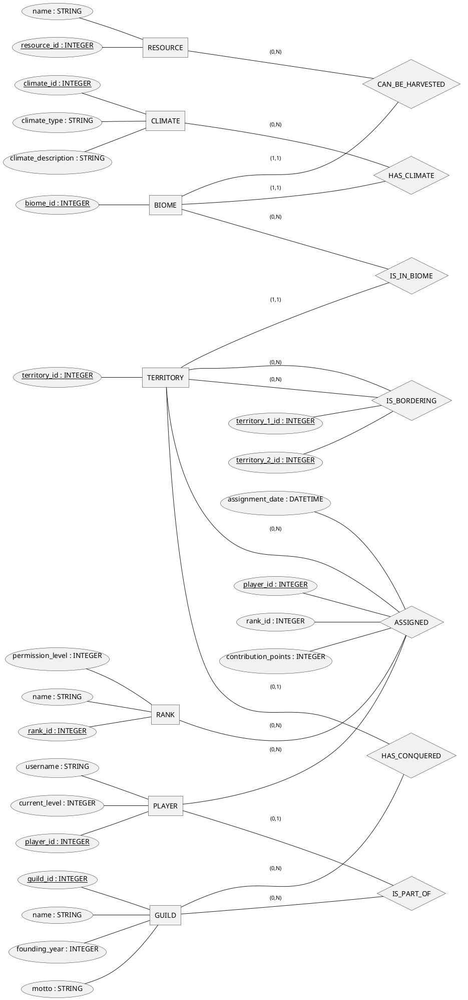

#relational_databases 

![[A03_ER_Normal.pdf]]

# ER - Diagram

```plantuml
@startchen

left to right direction

entity PLAYER {
	player_id : INTEGER <<key>>
	username : STRING
	current_level : INTEGER
}

entity GUILD {
	guild_id : INTEGER <<key>>
	name : STRING
	founding_year : INTEGER
	motto : STRING
}

relationship IS_PART_OF {
}

PLAYER -(0,1)- IS_PART_OF
GUILD -(0,N)- IS_PART_OF

entity TERRITORY {
	territory_id : INTEGER <<key>>
}

entity BIOME {
	biome_id : INTEGER <<key>>	
}

entity CLIMATE {
	climate_id : INTEGER <<key>>
	climate_type : STRING
	climate_description : STRING
}

entity RESOURCE {
	resource_id : INTEGER <<key>>
	name : STRING
}

relationship IS_IN_BIOME {
}

relationship CAN_BE_HARVESTED {
}

relationship HAS_CLIMATE {
}

TERRITORY -(1,1)- IS_IN_BIOME
BIOME -(0,N)- IS_IN_BIOME

RESOURCE -(0,N)- CAN_BE_HARVESTED
BIOME -(1,1)- CAN_BE_HARVESTED

BIOME -(1,1)- HAS_CLIMATE
CLIMATE -(0,N)- HAS_CLIMATE

relationship HAS_CONQUERED {
}

GUILD -(0,N)- HAS_CONQUERED
TERRITORY -(0,1)- HAS_CONQUERED

relationship IS_BORDERING {
	territory_1_id : INTEGER <<key>>
	territory_2_id : INTEGER <<key>>
}

TERRITORY -(0,N)- IS_BORDERING
TERRITORY -(0,N)- IS_BORDERING

relationship ASSIGNED {
	player_id : INTEGER <<key>>
	rank_id : INTEGER
	contribution_points : INTEGER
	assignment_date : DATETIME
}

entity RANK {
	rank_id : INTEGER <<key>>
	permission_level : INTEGER
	name : STRING
}


PLAYER -(0,N)- ASSIGNED
TERRITORY -(0,N)- ASSIGNED

RANK -(0,N)- ASSIGNED

@endchen
```

