#relational_databases 

![[A03_ER_Normal.pdf]]

# ER - Diagram

*plantuml didn’t want to render in vertically anymore for some reason?*

```plantuml
@startchen

entity PLAYER {
	player_id : INTEGER <<key>>
	username : STRING
	current_level : INTEGER
}

entity GUILD {
	guild_id : INTEGER <<key>>
	name : STRING
	founding_year : INTEGER
	motto : STRING
}

relationship IS_PART_OF {
}

PLAYER -(0,1)- IS_PART_OF
GUILD -(0,N)- IS_PART_OF

entity TERRITORY {
	territory_id : INTEGER <<key>>
	name : STRING
}

entity BIOME {
	biome_id : INTEGER <<key>>
	name : STRING
}

entity CLIMATE {
	climate_id : INTEGER <<key>>
	climate_type : STRING
	climate_description : STRING
}

entity RESOURCE {
	resource_id : INTEGER <<key>>
	name : STRING
}

relationship IS_IN_BIOME {
}

relationship CAN_BE_HARVESTED {
}

relationship HAS_CLIMATE {
}

TERRITORY -(1,1)- IS_IN_BIOME
BIOME -(0,N)- IS_IN_BIOME

RESOURCE -(0,N)- CAN_BE_HARVESTED
BIOME -(1,1)- CAN_BE_HARVESTED

BIOME -(1,1)- HAS_CLIMATE
CLIMATE -(0,N)- HAS_CLIMATE

relationship HAS_CONQUERED {
}

GUILD -(0,N)- HAS_CONQUERED
TERRITORY -(0,1)- HAS_CONQUERED

relationship IS_BORDERING {
	territory_1_id : INTEGER FK <<key>>
	territory_2_id : INTEGER FK <<key>>
}

TERRITORY -(0,N)- IS_BORDERING
TERRITORY -(0,N)- IS_BORDERING

relationship ASSIGNED {
	player_id : INTEGER FK <<key>>
	rank_id : INTEGER FK
	territory_id : INTEGER FK <<key>>
	contribution_points : INTEGER
	assignment_date : DATETIME
}

entity RANK {
	rank_id : INTEGER <<key>>
	permission_level : INTEGER
	name : STRING
}


PLAYER -(0,N)- ASSIGNED
TERRITORY -(0,N)- ASSIGNED

RANK -(0,N)- ASSIGNED

@endchen
```



![[Pasted image 20260331142311.png]]

# Keys

**guild:**
- guild_id is the pk
- everything else only depends on it

**player:**
- player_id is the pk
- everything else is dependent on it

**resource:**
- resource id is pk and name is dependent on it

**climate:**
- type and description is dependent on the id

**biome:**
- biome_id is pk
- resource_id, climate_id fk
- biome_id → name, resource_id, climate_id

**territory:**
- territory_id PK
- → name, biome_id

**is_bordering:**
- id_1 and id_2 are pk
- ideally should be a constraint not allowing duplicates

**player_rank:**
- rank_id is pk
- permission level and name depend on it

**assigned:**
- player_id, territory_id are PK 
- rank_id is excluded → players shouldn’t be assigned to the same territory with different ranks!

# SQL

```sql
CREATE DATABASE IF NOT EXISTS mmo_db;  
  
USE mmo_db;  
  
CREATE TABLE guild  
(  
    guild_id INTEGER AUTO_INCREMENT PRIMARY KEY,  
    name VARCHAR(120) UNIQUE,  
    founding_year INTEGER,  
    motto VARCHAR(500)  
);  
  
-- The IS_PART_OF relationship is 1:N and can be represented as  
-- a nullable foreign key in the player table!  
  
CREATE TABLE player  
(  
    player_id INTEGER AUTO_INCREMENT PRIMARY KEY,  
    username VARCHAR(120) UNIQUE,  
    current_level INTEGER,  
  
    guild_id INTEGER,  
  
    CONSTRAINT fk_player_guild  
    FOREIGN KEY (guild_id)  
    REFERENCES guild(guild_id)  
    ON DELETE SET NULL  
    ON UPDATE CASCADE);  
  
CREATE TABLE resource  
(  
    resource_id INTEGER AUTO_INCREMENT PRIMARY KEY,  
    name VARCHAR(120)  
);  
  
CREATE TABLE climate  
(  
    climate_id INTEGER AUTO_INCREMENT PRIMARY KEY,  
    climate_type VARCHAR(120),  
    climate_description VARCHAR(500)  
);  
  
  
-- A Biome has only one resource that can be harvested, so it references it as a foreign key  
-- A biome also only has one climate, so it also just references it as a fk  
  
CREATE TABLE biome  
(  
    biome_id INTEGER AUTO_INCREMENT PRIMARY KEY,  
    name VARCHAR(120),  
  
    resource_id INTEGER,  
    climate_id INTEGER,  
  
    CONSTRAINT fk_biome_resource  
    FOREIGN KEY (resource_id)  
    REFERENCES resource(resource_id)  
    ON DELETE SET NULL  
    ON UPDATE CASCADE,  
  
    CONSTRAINT fk_biome_climate  
    FOREIGN KEY (climate_id)  
    REFERENCES climate(climate_id)  
    ON DELETE SET NULL  
    ON UPDATE CASCADE);  
  
-- The is_in_biome relationship is 1:N, so territory needs a foreign key to biome!  
  
CREATE TABLE territory  
(  
    territory_id INTEGER AUTO_INCREMENT PRIMARY KEY,  
    name VARCHAR(120),  
  
    biome_id INTEGER,  
  
    CONSTRAINT fk_territory_biome  
    FOREIGN KEY (biome_id)  
    REFERENCES biome(biome_id)  
    ON DELETE CASCADE  
    ON UPDATE CASCADE);  
  
-- since we have a N:M relationship here, a new table is needed  
  
CREATE TABLE is_bordering  
(  
    territory_id_1 INTEGER,  
    territory_id_2 INTEGER,  
  
    PRIMARY KEY (territory_id_1, territory_id_2),  
  
    CONSTRAINT fk_is_bordering_territory_1  
    FOREIGN KEY (territory_id_1)  
    REFERENCES territory(territory_id)  
    ON DELETE CASCADE  
    ON UPDATE CASCADE,  
  
    CONSTRAINT fk_is_bordering_territory_2  
    FOREIGN KEY (territory_id_2)  
    REFERENCES territory(territory_id)  
    ON DELETE CASCADE  
    ON UPDATE CASCADE
);  
  
-- had to rename to player_rank since rank is a reserved keyword  
CREATE TABLE player_rank  
(  
    rank_id INTEGER AUTO_INCREMENT PRIMARY KEY,  
    permission_level INTEGER,  
    name VARCHAR(120)  
);  
  
-- this is a triple relationship N:M:O  
-- I chose player and territory as primary IDs, since i don't want a player to be assigned to the same territory twice with different ids  
-- it makes more sense that way...  
  
CREATE TABLE assigned  
(  
    player_id INTEGER,  
    territory_id INTEGER,  
    rank_id INTEGER,  
  
    PRIMARY KEY (player_id, territory_id),  
  
    contribution_points INTEGER,  
    assignment_date DATETIME,  
  
    CONSTRAINT fk_assigned_player  
    FOREIGN KEY (player_id)  
    REFERENCES player(player_id)  
    ON DELETE CASCADE  
    ON UPDATE CASCADE,  
  
    CONSTRAINT fk_assigned_territory  
    FOREIGN KEY (territory_id)  
    REFERENCES territory(territory_id)  
    ON DELETE CASCADE  
    ON UPDATE CASCADE,  
  
    CONSTRAINT fk_assigned_rank  
    FOREIGN KEY (rank_id)  
    REFERENCES player_rank (rank_id)  
    ON DELETE SET NULL  
    ON UPDATE CASCADE);
```

